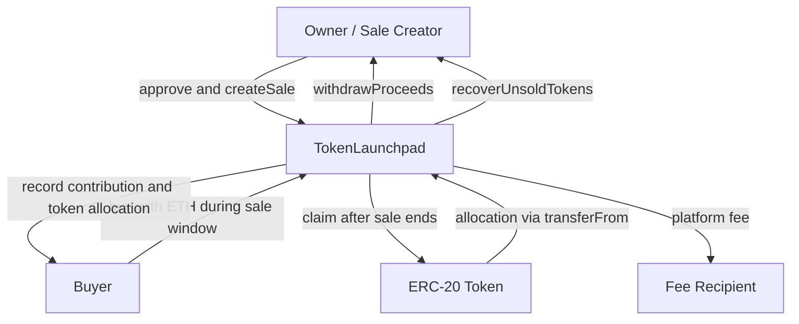

# Token Launchpad

An owner-controlled, non-minting ERC-20 token sale contract built with
Solidity and Foundry. Sale tokens are deposited into the launchpad before a
sale begins, buyers purchase allocations with ETH, and buyers claim their
tokens after the sale ends.

## Contents

- [Overview](#overview)
- [Architecture](#architecture)
- [Purpose](#purpose)
- [Sale Lifecycle](#sale-lifecycle)
- [Sale State](#sale-state)
- [Access Control](#access-control)
- [Purchase Accounting](#purchase-accounting)
- [Time Window](#time-window)
- [Safety Checks](#safety-checks)
- [Implementation Notes](#implementation-notes)
- [Foundry Proof](#foundry-proof)
- [Development](#development)

## Overview

The launchpad manages multiple independent sales using a sale ID. Each sale
defines its token, price, allocation, sale window, hard cap, and per-wallet
limit. The contract holds the sale tokens during the sale and records buyer
allocations until they are claimed.

## Purpose

The Token Launchpad provides a controlled ERC-20 token-sale mechanism. A
sale creator configures the sale terms, buyers purchase tokens during a
defined window, buyers claim purchased tokens after the sale, and
proceeds can only be withdrawn after the sale ends.

## Architecture



The launchpad is non-minting. Before calling `createSale`, the owner must
approve the launchpad to transfer the sale allocation. The launchpad then
holds the tokens while recording purchases, and transfers purchased tokens
to buyers only after the sale ends.

## Sale Lifecycle

### 1. Create and fund a sale

The owner configures the sale and deposits the full token allocation through
`transferFrom`. The sale receives a unique ID and cannot start immediately;
its start time must be in the future.

### 2. Accept purchases

During the active interval, buyers send ETH to `buy(saleId)`. The contract
records each buyer's contribution and purchased token amount without
transferring tokens yet.

### 3. End the sale

At `endTime`, purchases stop. The interval is `[startTime, endTime)`, so a
purchase at `startTime` is valid and a purchase at exactly `endTime` is
rejected.

### 4. Settle the sale

After the sale ends:

- buyers call `claim(saleId)` to receive purchased tokens
- the owner calls `withdrawProceeds(saleId)` to distribute ETH
- the owner calls `recoverUnsoldTokens(saleId)` to retrieve the remainder

## Sale State

Each sale stores information such as:

- creator
- ERC-20 token
- token price
- token allocation
- start time
- end time
- hard cap
- per-wallet limit
- total tokens sold
- total proceeds
- buyer purchase information

The implementation uses a sale ID so multiple independent sales can be
managed by the same contract.

## Access Control

The deployer becomes the immutable contract owner.

```solidity
address public immutable owner;
```

Administrative actions such as sale creation, proceeds withdrawal, and
unsold-token recovery are restricted to the owner.

Ownership transfer was intentionally omitted to keep the access model
small and explicit.

## Purchase Accounting

The price represents the amount of wei required for one whole 18-decimal
token.

For example:

```text
Price = 0.001 ETH

0.001 ETH -> 1 token
0.010 ETH -> 10 tokens
1 ETH     -> 1000 tokens
```

Exact payment is enforced by checking that `msg.value` divides evenly by
the configured token price.

```solidity
if (msg.value % sale.price != 0) {
    revert IncorrectPayment();
}
```

The purchased token amount is then:

```text
(msg.value / price) * 1e18
```

This prevents ambiguous fractional purchases.

## Time Window

The active sale interval is:

```text
[startTime, endTime)
```

A purchase at exactly `startTime` is valid, while a purchase at exactly
`endTime` is rejected.

Claims, withdrawals, and unsold-token recovery become available once the
sale has ended.

## Safety Checks

Purchases enforce:

- active sale window
- correct payment
- hard cap
- per-wallet limit
- remaining token allocation

Buyer allocations are stored rather than transferring sale tokens
immediately. This separates the purchase phase from the claim phase.

## Implementation Notes

### Stack-Depth Refactor

The initial design exposed a large public struct getter and a large
`SaleCreated` event. This contributed to a `stack too deep` compilation
issue.

The implementation was simplified by:

- making the sale mapping private
- adding an explicit `getSale()` function
- reducing `SaleCreated` to important indexed identifiers
- assigning struct fields through storage rather than a large struct
  literal

This reduced compiler pressure while keeping the API readable.

### Proceeds and Fees

When proceeds are withdrawn, the configured platform fee is calculated in
basis points and sent to `feeRecipient`. The remaining ETH is sent to the
owner. Both withdrawals and unsold-token recovery are available only after
the sale ends and can each be performed once per sale.

## Foundry Proof

The test suite verifies:

- sale time windows
- multiple buyers
- hard-cap enforcement
- wallet limits
- post-sale claims
- unauthorized withdrawals

## Development

### Foundry

**Foundry is a blazing fast, portable and modular toolkit for Ethereum application development written in Rust.**

Foundry consists of:

- **Forge**: Ethereum testing framework (like Truffle, Hardhat and DappTools).
- **Cast**: Swiss army knife for interacting with EVM smart contracts, sending transactions and getting chain data.
- **Anvil**: Local Ethereum node, akin to Ganache, Hardhat Network.
- **Chisel**: Fast, utilitarian, and verbose solidity REPL.

### Documentation

https://book.getfoundry.sh/

### Usage

#### Build

```shell
$ forge build
```

#### Test

```shell
$ forge test
```

#### Format

```shell
$ forge fmt
```

#### Gas Snapshots

```shell
$ forge snapshot
```

#### Anvil

```shell
$ anvil
```

#### Deploy

```shell
$ forge script script/DeployTokenLaunchpad.s.sol:DeployTokenLaunchpad --rpc-url <your_rpc_url> --private-key <your_private_key>
```

#### Cast

```shell
$ cast <subcommand>
```

#### Help

```shell
$ forge --help
$ anvil --help
$ cast --help
```
